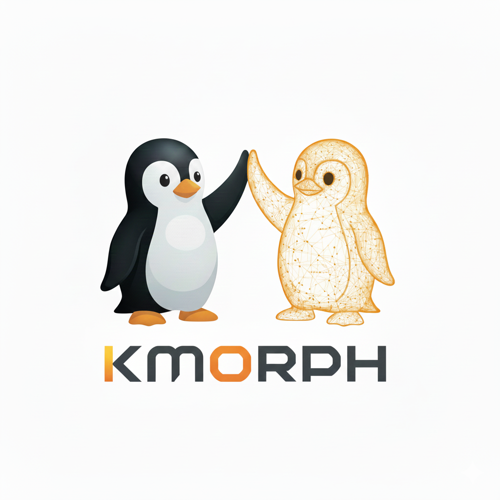

# kmorph — Transforming Kernels Without Reboots

## Overview

`kmorph` is a runtime management system for multikernel architectures, providing automated health monitoring, failure recovery, and zero-downtime kernel live upgrades. It consists of two main components:

- **`kmorphd`** - kmorph daemon providing continuous runtime orchestration
- **`kmorphctl`** - Command-line interface for runtime operations

### Relationship to kerf

`kmorph` complements [kerf](https://github.com/multikernel/kerf):

- **kerf**: Configuration and resource allocation (device tree management, instance creation)
- **kmorph**: Runtime management and orchestration (monitoring, healing, morphing/upgrades)

Both projects share the underlying `libkerf` library for device tree operations and state management.

## Core Features

### 1. Automatic Health Monitoring

Continuous heartbeat-based health monitoring of kernel instances with configurable policies:

- **Heartbeat protocol** over vsock transport
- **Configurable timeouts** (development: 60s, production: 1s)
- **Health metrics** collection (CPU, memory, I/O responsiveness)
- **Failure detection** with exponential backoff for transient issues

### 2. Auto-Healing and Recovery

Automated failure detection and resource recovery:

- **Automatic failover** when kernel instance becomes unresponsive
- **Resource reclamation** from crashed kernels
- **Graceful degradation** with notification to operators
- **vmcore capture** during recovery for post-mortem analysis

### 3. Zero-Downtime Kernel Morphing (Live Upgrade)

Interactive kernel morph/upgrade protocol with minimal downtime (<10ms):

- **State negotiation** between old and new kernels
- **Capability validation** before commit
- **Atomic handover** of resources and workloads
- **Rollback support** if upgrade fails validation

### 4. vmcore Capture Integration

Replaces traditional kdump with multikernel-aware crash capture:

- **Parallel capture** by surviving kernel instances
- **No system reboot** required
- **Preserved system state** across other instances
- **Standard vmcore format** compatible with crash analysis tools

## Architecture

### System Components

```
┌─────────────────────────────────────────────────────────────┐
│                         User Space                          │
├─────────────────────────────────────────────────────────────┤
│  kmorphctl CLI                                              │
│  ├─ Commands: spawn, monitor, morph, recover                │
│  └─ Communicates with daemon via Unix socket                │
├─────────────────────────────────────────────────────────────┤
│  kmorphd Daemon                                             │
│  ├─ Health Monitor: Heartbeat protocol, timeout detection   │
│  ├─ Recovery Manager: Auto-heal, vmcore capture             │
│  ├─ Morphing Orchestrator: State transfer, validation       │
│  └─ vsock Protocol Handler: KMP implementation              │
├─────────────────────────────────────────────────────────────┤
│  libkerf (Shared Library)                                   │
│  ├─ Device tree parsing and manipulation                    │
│  ├─ Instance state management                               │
│  └─ Resource allocation APIs                                │
└─────────────────────────────────────────────────────────────┘
                          │
                          │ vsock (port 9000)
                          │
┌─────────────────────────────────────────────────────────────┐
│                       Kernel Space                          │
├─────────────────────────────────────────────────────────────┤
│  kerf-vsock.ko                                              │
│  ├─ VSOCK_TRANSPORT_F_LOCAL transport                       │
│  ├─ CID mapping: instance_id + 2                            │
│  ├─ Hybrid IPI/shared-memory backend                        │
│  └─ Fast path (<256 bytes) via IPI                          │
├─────────────────────────────────────────────────────────────┤
│  Kernel Instance (Running)                                  │
│  ├─ Heartbeat responder                                     │
│  ├─ State serialization hooks                               │
│  └─ Resource handover support                               │
└─────────────────────────────────────────────────────────────┘
```

### Daemon Architecture

```
kmorphd (kmorph Daemon)
├─ Main Event Loop
│  ├─ vsock connection manager
│  ├─ Unix socket server (CLI communication)
│  └─ Timer management (heartbeats, timeouts)
│
├─ Health Monitor Module
│  ├─ Heartbeat sender
│  ├─ Timeout detector
│  ├─ Health metric aggregator
│  └─ Policy engine (per-instance policies)
│
├─ Recovery Manager Module
│  ├─ Failure detector
│  ├─ Resource reclaim coordinator
│  ├─ Vmcore capture controller
│  └─ Auto-heal state machine
│
├─ Morphing Orchestrator Module
│  ├─ State transfer negotiator
│  ├─ Validation coordinator
│  ├─ Atomic handover controller
│  └─ Rollback handler
│
└─ Protocol Handler (KMP)
   ├─ Message serialization/deserialization
   ├─ Connection management
   ├─ Retry and timeout logic
   └─ Protocol state machines
```

## Kernel Morphing Protocol (KMP)

### Protocol Design

The **Kernel Morphing Protocol (KMP)** runs over vsock on port 9000, providing reliable message exchange between kmorphd and kernel instances.

#### Message Format

```
┌──────────────────────────────────────────────────────────┐
│ Message Header (32 bytes)                                │
├──────────────────────────────────────────────────────────┤
│ magic        : u32  (e.g., 0x4B4D5000 = "KMP\0")            │
│ version      : u16  (protocol version)                   │
│ msg_type     : u16  (message type enum)                  │
│ sequence     : u32  (for request/response matching)      │
│ payload_len  : u32  (length of payload in bytes)         │
│ timestamp    : u64  (nanoseconds since boot)             │
│ crc32        : u32  (checksum of header + payload)       │
│ reserved     : u32  (for future use)                     │
└──────────────────────────────────────────────────────────┘
│ Payload (variable length)                                │
└──────────────────────────────────────────────────────────┘
```

#### Message Types

**Health Monitoring:**
- `KMP_HEARTBEAT_REQ` - Heartbeat request from daemon
- `KMP_HEARTBEAT_RSP` - Heartbeat response with health metrics
- `KMP_HEALTH_STATUS` - Unsolicited health status report

**Auto-Healing:**
- `KMP_RECOVER_PREPARE` - Prepare for resource reclamation
- `KMP_RECOVER_RECLAIM` - Reclaim resources from failed instance
- `KMP_RECOVER_COMPLETE` - Recovery completed
- `KMP_VMCORE_START` - Begin vmcore capture
- `KMP_VMCORE_DATA` - vmcore data chunk
- `KMP_VMCORE_COMPLETE` - vmcore capture complete

**Kernel Morphing (Live Upgrade):**
- `KMP_MORPH_PREPARE` - Prepare for morph/upgrade
- `KMP_MORPH_NEGOTIATE` - Negotiate capabilities
- `KMP_MORPH_TRANSFER_STATE` - Transfer runtime state
- `KMP_MORPH_VALIDATE` - Validate new kernel readiness
- `KMP_MORPH_COMMIT` - Commit to new kernel (atomic handover)
- `KMP_MORPH_ROLLBACK` - Abort morph, revert to old kernel

**Error Handling:**
- `KMP_ERROR` - Error response with error code and message
- `KMP_RETRY` - Request retry with exponential backoff

### Protocol State Machines

#### Auto-Healing State Machine

```
MONITORING
    │
    ├─ Heartbeat timeout detected
    │
    ▼
DETECTING_FAILURE
    │
    ├─ Confirmed failure (multiple timeouts)
    │
    ▼
PREPARING_RECOVERY
    │
    ├─ Send KMP_RECOVER_PREPARE to surviving kernels
    │
    ▼
CAPTURING_VMCORE (optional)
    │
    ├─ Parallel vmcore capture by another instance
    │
    ▼
RECLAIMING_RESOURCES
    │
    ├─ Send KMP_RECOVER_RECLAIM
    ├─ Update device tree
    ├─ Broadcast new topology
    │
    ▼
RECOVERY_COMPLETE
    │
    └─ Return to MONITORING
```

#### Kernel Morphing State Machine

```
RUNNING
    │
    ├─ User initiates morph (kmorphctl morph)
    │
    ▼
MORPH_PREPARING
    │
    ├─ Spawn new kernel instance
    ├─ Send KMP_MORPH_PREPARE to old kernel
    │
    ▼
MORPH_NEGOTIATING
    │
    ├─ Exchange capabilities (KMP_MORPH_NEGOTIATE)
    ├─ Verify compatibility
    │
    ▼
MORPH_TRANSFERRING
    │
    ├─ Transfer runtime state (KMP_MORPH_TRANSFER_STATE)
    ├─ Map state: memory regions, file descriptors, network connections
    │
    ▼
MORPH_VALIDATING
    │
    ├─ New kernel validates received state (KMP_MORPH_VALIDATE)
    ├─ Run health checks
    ├─ Decision: COMMIT or ROLLBACK
    │
    ├─────────────┐
    │             │
    ▼             ▼
COMMITTING    ROLLING_BACK
    │             │
    ├─ Atomic     ├─ Terminate new kernel
    │  handover   ├─ Return resources
    │             └─ Resume old kernel
    │
    ▼
RUNNING (new kernel)
```

### Transport Design: Hybrid IPI/vsock

The vsock transport uses a two-path approach for optimal performance:

#### Fast Path (IPI-based)
- **Message size:** < 256 bytes
- **Latency:** 1-2μs
- **Use cases:** Heartbeat, quick status, error notifications
- **Implementation:** Direct IPI ring buffer

#### Bulk Path (Shared Memory)
- **Message size:** ≥ 256 bytes
- **Latency:** 200-500μs for 210KB
- **Use cases:** State transfer, vmcore data, capability negotiation
- **Implementation:** Shared memory with IPI notification

## Command-Line Interface

### kmorphctl Commands

#### Daemon Management

```bash
# Start the multikernel daemon
kmorphctl daemon start [--config=/etc/kmorph/kmorphd.conf]

# Stop the daemon
kmorphctl daemon stop [--graceful]

# Check daemon status
kmorphctl daemon status

# Reload configuration without restart
kmorphctl daemon reload
```

#### Instance Lifecycle

```bash
# Spawn a kernel instance (requires kerf configuration)
kmorphctl spawn <instance-name> --kernel=<vmlinuz-path> [options]
  Options:
    --kernel-cmdline="..."      # Override kernel command line
    --initramfs=<path>          # Specify initramfs
    --monitor                   # Enable auto-healing (default: true)
    --heartbeat-timeout=<sec>   # Custom heartbeat timeout

# List running instances
kmorphctl list [--verbose]

# Show instance status
kmorphctl status <instance-name>

# Terminate instance
kmorphctl terminate <instance-name> [--force]
```

#### Monitoring and Health

```bash
# Show real-time monitoring dashboard
kmorphctl monitor [--instance=<name>]

# Display heartbeat status
kmorphctl heartbeat <instance-name>

# Show health metrics
kmorphctl health <instance-name> [--metrics=cpu,memory,io]

# Test heartbeat manually
kmorphctl ping <instance-name>
```

#### Auto-Healing and Recovery

```bash
# Trigger manual recovery
kmorphctl recover <instance-name>

# Capture vmcore from failed instance
kmorphctl vmcore capture <instance-name> --output=<path>

# Analyze captured vmcore
kmorphctl vmcore analyze <vmcore-file>

# Show recovery history
kmorphctl recovery-log [--instance=<name>] [--since=<time>]
```

#### Kernel Morphing (Live Upgrade)

```bash
# Prepare morph (spawn new kernel, no traffic switch)
kmorphctl morph prepare <instance-name> --kernel=<new-vmlinuz>

# Validate new kernel (run health checks)
kmorphctl morph validate <instance-name>

# Commit morph (atomic handover)
kmorphctl morph commit <instance-name>

# Rollback if validation fails
kmorphctl morph rollback <instance-name>

# Full morph in one command (prepare → validate → commit)
kmorphctl morph <instance-name> --kernel=<new-vmlinuz> [--auto-commit]
```

#### Policy Management

```bash
# Show current policies
kmorphctl policy show [--instance=<name>]

# Set heartbeat timeout
kmorphctl policy set heartbeat-timeout <instance-name> <seconds>

# Set auto-healing behavior
kmorphctl policy set auto-heal <instance-name> <enabled|disabled>

# Set morph validation timeout
kmorphctl policy set morph-timeout <instance-name> <seconds>

# Export policy configuration
kmorphctl policy export [--output=<file>]

# Import policy configuration
kmorphctl policy import <file>
```

### Example Workflows

#### Production Deployment with Auto-Healing

```bash
# 1. Configure resources with kerf
kerf create web-server --cpus=4-15 --memory=16GB

# 2. Start kmorphd daemon
kmorphctl daemon start

# 3. Spawn instance with auto-healing
kmorphctl spawn web-server   --kernel=/boot/vmlinuz-6.8.0   --heartbeat-timeout=1   --monitor

# 4. Monitor health
kmorphctl monitor --instance=web-server

# 5. Automatic recovery happens if instance fails
# Check recovery log
kmorphctl recovery-log --instance=web-server
```

#### Zero-Downtime Kernel Morph

```bash
# 1. Prepare morph (spawn new kernel)
kmorphctl morph prepare web-server --kernel=/boot/vmlinuz-6.9.0

# 2. Validate new kernel
kmorphctl morph validate web-server
# Output: Validation successful (health checks passed)

# 3. Commit morph (atomic handover, <10ms downtime)
kmorphctl morph commit web-server

# 4. Verify new kernel running
kmorphctl status web-server
# Output: Running kernel: 6.9.0
```

#### Manual Recovery with vmcore Capture

```bash
# 1. Instance becomes unresponsive
kmorphctl status database-server
# Output: Status: UNRESPONSIVE (last heartbeat: 62s ago)

# 2. Capture vmcore for analysis
kmorphctl vmcore capture database-server   --output=/var/crash/database-vmcore-$(date +%s)

# 3. Trigger recovery
kmorphctl recover database-server

# 4. Analyze vmcore later
kmorphctl vmcore analyze /var/crash/database-vmcore-*
```

## Integration with kerf

### Division of Responsibilities

**kerf (Configuration):**
- Device tree creation and validation
- Resource allocation planning
- Instance definition (CPU, memory, I/O)
- Static configuration management

**kmorph (Runtime):**
- Instance execution and monitoring
- Health checking and auto-healing
- Live morphing and state management
- Runtime policy enforcement

### Workflow Integration

```bash
# Step 1: Configure with kerf
kerf init --baseline=/boot/system.dts
kerf create web-server --cpus=4-15 --memory=16GB
kerf validate

# Step 2: Execute with kmorph
kmorphctl spawn web-server --kernel=/boot/vmlinuz
kmorphctl monitor

# Step 3: Morph with kmorph (updates kerf config)
kmorphctl morph web-server --kernel=/boot/vmlinuz-new
# kmorph automatically updates device tree via libkerf
```

### Shared State via libkerf

Both `kerf` and `kmorphd` use `libkerf` for state management:

```python
# libkerf Python API (used by both kerf and kmorphd)
from libkerf import DeviceTree, Instance

# Read instance configuration (used by both)
dt = DeviceTree.load("/var/lib/kerf/instances/web-server.dts")
instance = Instance.from_device_tree(dt)

# kerf: Create and validate
instance.validate_resources()
instance.save()

# kmorphd: Read and execute
instance = Instance.load("web-server")
instance.spawn(kernel="/boot/vmlinuz")
instance.monitor(heartbeat_timeout=5)
```

## Implementation Technologies

### Language and Frameworks

- **Daemon (kmorphd):** Rust
  - Async runtime: Tokio
  - vsock: Custom implementation using `VSOCK_TRANSPORT_F_LOCAL`
  - Serialization: bincode for protocol, serde for config
  - Logging: tracing + tracing-subscriber
  - Metrics: Prometheus exporter

- **CLI (kmorphctl):** Rust
  - CLI framework: clap
  - Unix socket client: tokio::net::UnixStream
  - Output formatting: prettytable-rs, serde_json

- **Kernel Module (kerf-vsock.ko):** C
  - vsock transport implementation
  - Integration with existing IPI infrastructure
  - Shared memory management for bulk transfers

- **Shared Library (libkerf):** Python + Rust
  - Python: High-level API for scripting
  - Rust: Core device tree parsing (dtc integration)
  - FFI: PyO3 for Python bindings

### Dependencies

**Daemon:**
- tokio (async runtime)
- vsock (custom implementation)
- serde, serde_yaml (configuration)
- tracing (logging)
- prometheus (metrics export)

**CLI:**
- clap (command-line parsing)
- tokio (async Unix socket client)
- prettytable-rs (table formatting)
- indicatif (progress bars)

**Kernel Module:**
- Linux kernel headers
- vsock kernel APIs
- IPI infrastructure from multikernel patches


## Future Enhancements

### Planned Features

1. **Multi-instance coordination**
   - Coordinated morphs across related instances
   - Load balancing during morphs
   - Cascading failure detection

2. **State transfer optimization**
   - Incremental state transfer (delta updates)
   - Compression for large state
   - Background pre-warming of new kernels

3. **Advanced monitoring**
   - Per-syscall latency tracking
   - Resource utilization trending
   - Anomaly detection via ML

4. **Integration ecosystem**
   - Kubernetes operator for multikernel pods
   - Terraform provider for infrastructure-as-code
   - Grafana dashboard templates

5. **Enhanced recovery**
   - Partial recovery (reclaim only failed subsystems)
   - Checkpoint/restore integration
   - Live migration between physical hosts


## References

- [kerf Project](https://github.com/your-org/kerf) - Resource configuration framework
- [Multikernel Architecture Design](/mnt/project/Multikernel_Overall_Design.md)
- [vsock Protocol](https://www.kernel.org/doc/html/latest/networking/vsock.html)
- [Live Update Orchestrator (LUO)](https://lwn.net/Articles/1021442/) - Comparison and design decisions

---

